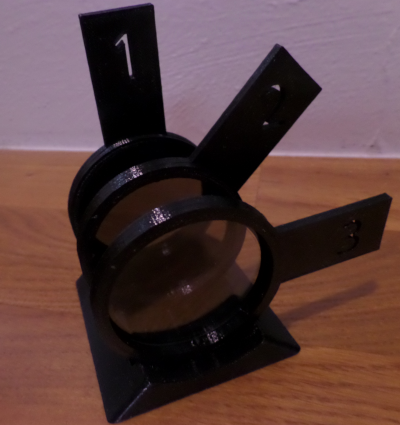
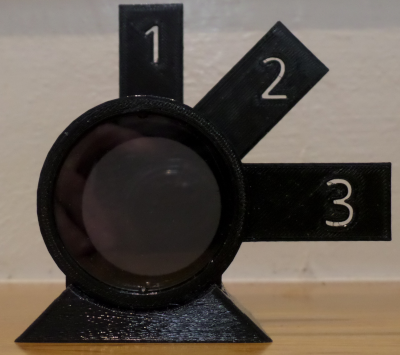
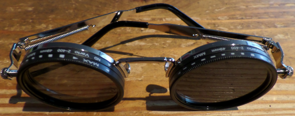
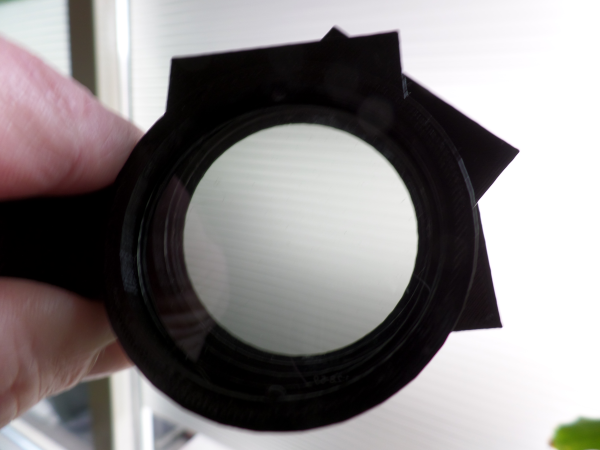
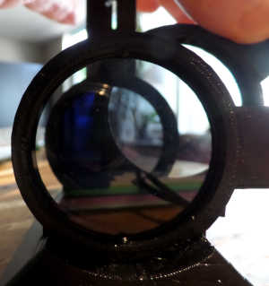

# 3D Printed Polarizer Experiment  

## What is this?

   

A small 3D-printed setup showing the non intuitive behaviour of polarized light.  
To build this project you will need a 3d printer and some cheap polarizing sunglasses.

These glasses contain the 44mm filters that we need.  

## The setup
  
### Calibrating the filters   
  
After printing the `stl` files and fitting the filters, the filter angles should be calibrated relative to each other.  

     

This is done by rotating the individual filters in the holders until all three are aligned.      
The calibration is complete when the maximum amount of light is passing all 3 filters with the number tabs aligned.    

Take note that there is a front and backside for the filters, so if not all filters are in the same orientation you might get unexpected results.

## The experiment

The holders have fixed reference orientations of **0°, 45° and 90°**, allowing the filters to be arranged and compared mechanically.  

- **0° + 90°** → dark
- **0° + 90° + 45°** → transmission
- Change the order of the filters → the result can change.

The fun part is that the filters behave as successive transformations of the polarization state.    
Their composition is **not commutative**: `1 × 2 × 3` is not generally the same as `1 × 3 × 2`.

---

## Files

The holders and base are provided as printable 3D files.

## License

**CC BY 4.0**
